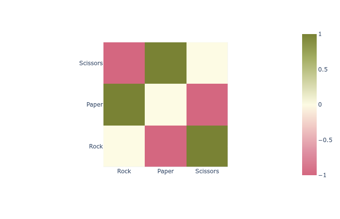
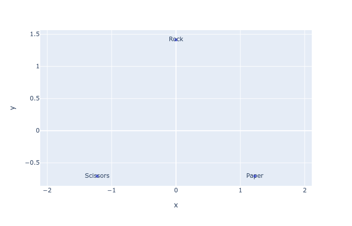
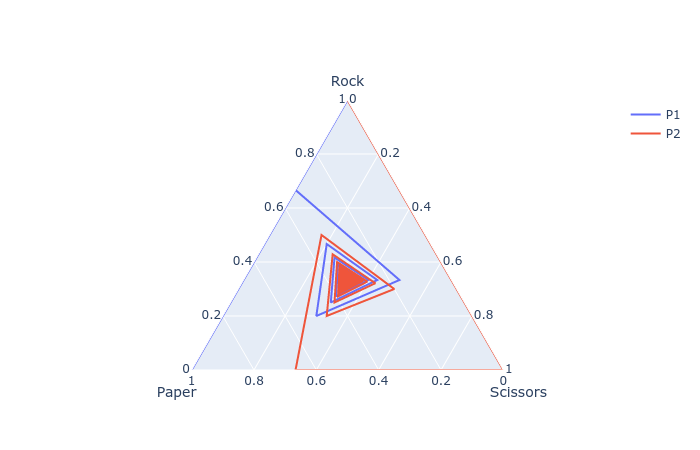
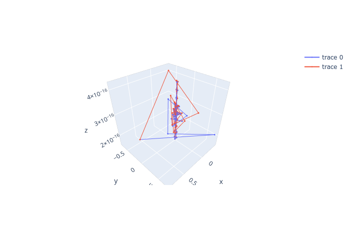

# Red-Cliffs
A Python package for game theory, especially its visualization.

## Examples
- Payoff matrix: 

- PCA: 

- Nash Equilibrium: 

## Documentations
Star this repository to encourage me to overcome my procrastination.
